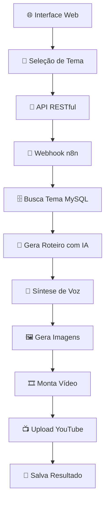

# 🎬 YouTube Automation System

Sistema completo de automação para criação de vídeos YouTube com IA, interface web e processamento otimizado.


## 🚀 Visão Geral

Este sistema automatiza completamente o processo de criação de vídeos para YouTube:

- **🎨 Interface Web** para seleção de temas
- **🤖 Geração de Roteiro** com IA personalizada por tema
- **🎵 Síntese de Voz** usando ElevenLabs
- **🖼️ Geração de Imagens** com IA
- **🎞️ Montagem de Vídeo** automatizada
- **📺 Upload Direto** para YouTube
- **🗄️ Armazenamento MySQL** sem arquivos locais

## ✨ Principais Funcionalidades

### 🎯 **Temas Personalizados**
- **👽 Horror Extraterrestre** - Histórias de terror alien
- **📜 Mistérios Históricos** - Enigmas não resolvidos  
- **⚛️ Ciência e Tecnologia** - Descobertas científicas
- **👤 Biografias Inspiradoras** - Histórias de sucesso
- **🌍 Curiosidades do Mundo** - Fatos interessantes
- **📈 Desenvolvimento Pessoal** - Dicas de crescimento

### 🔧 **Arquitetura Otimizada**
- **Zero Armazenamento Local** - Tudo processado na memória
- **Base64 MySQL** - Arquivos armazenados no banco
- **FFmpeg Streaming** - Processamento direto com pipes
- **API RESTful** - Integração moderna e escalável

## 📁 Estrutura do Projeto

```
📦 YouTube Automation
├── 🌐 Interface Web
│   ├── interface_selecao_temas.html    # Interface principal
│   └── api_server.js                   # Servidor API Node.js
├── 🤖 Automação n8n
│   ├── youtube_otimizado_mysql.json    # Workflow otimizado
│   └── youtube.json                    # Workflow original
├── 🗄️ Banco de Dados
│   ├── setup_mysql.sql                # Script de configuração
│   └── queries_uteis_mysql.md         # Queries de monitoramento
├── 📚 Documentação
│   ├── README_OTIMIZACAO_MYSQL.md     # Documentação das otimizações
│   ├── README_INTERFACE.md            # Guia da interface web
│   └── queries_uteis_mysql.md         # Queries úteis
└── ⚙️ Configuração
    ├── package.json                   # Dependências Node.js
    └── .env.example                   # Exemplo de configuração
```

## 🛠️ Instalação Rápida

### 1. **Clone o Repositório**
```bash
git clone <repository-url>
cd Automações_Youtube
```

### 2. **Configure o Banco MySQL**
```bash
mysql -u root -p < setup_mysql.sql
```

### 3. **Configure a API**
```bash
npm install
cp .env.example .env
# Edite o arquivo .env com suas configurações
npm start
```

### 4. **Configure o n8n**
```bash
# Importe o arquivo: youtube_otimizado_mysql.json
# Configure as credenciais necessárias
```

### 5. **Acesse a Interface**
```
http://localhost:3000
```

## 🔌 APIs Integradas

- **🎤 ElevenLabs** - Text-to-Speech
- **🧠 GROQ** - Transcrição de áudio
- **🖼️ Replicate** - Geração de imagens
- **📺 YouTube API** - Upload e configuração
- **☁️ Google Drive** - Backup e armazenamento
- **📊 Google Sheets** - Controle e dados

## 📊 Monitoramento

### **Dashboard de Estatísticas**
```http
GET /api/stats
```

### **Projetos em Andamento**
```http
GET /api/projects?status=processando
```

### **Uso de Armazenamento**
```sql
SELECT file_type, COUNT(*) as arquivos, 
       SUM(LENGTH(file_data) * 3/4) / 1024 / 1024 as tamanho_mb
FROM youtube_files GROUP BY file_type;
```

## 🔄 Fluxo de Automação



## 🎯 Casos de Uso

### **Para Criadores de Conteúdo**
- Automação completa de produção
- Múltiplos temas e nichos
- Escalabilidade de produção

### **Para Agências**
- Produção em massa
- Clientes múltiplos
- Monitoramento centralizado

### **Para Desenvolvedores**
- API aberta para integração
- Workflow customizável
- Arquitetura moderna

## 🔐 Segurança

- ✅ **Prepared Statements** para SQL
- ✅ **Validação de entrada** em todos endpoints
- ✅ **CORS configurado** adequadamente
- ✅ **Rate limiting** para APIs
- ✅ **Logs de auditoria** completos

## 📈 Performance

- ⚡ **Processamento na memória** - Zero I/O desnecessário
- ⚡ **Pool de conexões MySQL** - Conexões otimizadas
- ⚡ **FFmpeg streaming** - Processamento direto
- ⚡ **Limpeza automática** - Gestão de recursos

## 🧪 Tecnologias

### **Backend**
- **Node.js** + Express
- **MySQL** 8.0+
- **n8n** Workflow Engine

### **IA e APIs**
- **ElevenLabs** - Text-to-Speech
- **GROQ** - Speech-to-Text
- **Replicate** - Image Generation
- **Google Gemini** - Text Generation

### **Frontend**
- **HTML5** + CSS3
- **JavaScript ES6+**
- **Responsive Design**

## 📚 Documentação

- [🔧 Guia de Otimizações](README_OTIMIZACAO_MYSQL.md)
- [🌐 Interface Web](README_INTERFACE.md)
- [🗄️ Queries Úteis](queries_uteis_mysql.md)

## 🤝 Contribuição

1. Fork o projeto
2. Crie uma branch para sua feature (`git checkout -b feature/AmazingFeature`)
3. Commit suas mudanças (`git commit -m 'Add some AmazingFeature'`)
4. Push para a branch (`git push origin feature/AmazingFeature`)
5. Abra um Pull Request

## 📄 Licença

Este projeto está sob a licença MIT. Veja o arquivo `LICENSE` para mais detalhes.

## 🆘 Suporte

- **Issues**: Reporte bugs e solicite features
- **Discussions**: Tire dúvidas e compartilhe ideias
- **Wiki**: Documentação detalhada

## 🏆 Métricas do Projeto


---

**Desenvolvido com ❤️ para automatizar a criação de conteúdo no YouTube**

*Sistema completo, robusto e escalável para produção profissional de vídeos automatizados*
