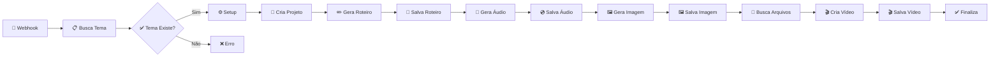

# 🚀 YouTube MySQL Tool Otimizado

## 📋 Visão Geral

Este workflow foi completamente otimizado para usar o **MySQL Tool** nativo do n8n em vez de requisições HTTP para o banco de dados. Isso oferece:

- ✅ **Performance Superior**: Conexões nativas são mais rápidas
- ✅ **Maior Confiabilidade**: Menos pontos de falha
- ✅ **Melhor Segurança**: Credenciais gerenciadas pelo n8n
- ✅ **Sintaxe Simplificada**: Queries SQL diretas
- ✅ **Transações Automáticas**: Rollback em caso de erro

## 🔧 Principais Otimizações

### 1. **Substituição de HTTP por MySQL Tool**
```json
// ❌ Antes (HTTP Request)
{
  "type": "n8n-nodes-base.httpRequest",
  "parameters": {
    "url": "http://api:3000/api/projects",
    "method": "POST",
    "body": {...}
  }
}

// ✅ Agora (MySQL Tool)
{
  "type": "n8n-nodes-base.mysql",
  "parameters": {
    "operation": "insert",
    "table": "youtube_projects",
    "columns": "project_id, tema_id, status",
    "values": [...]
  }
}
```

### 2. **Operações MySQL Diretas**

#### **📁 Criação de Projeto**
```sql
INSERT INTO youtube_projects 
(project_id, tema_id, status, titulo, descricao, created_at) 
VALUES (?, ?, ?, ?, ?, ?)
```

#### **💾 Atualização de Status**
```sql
UPDATE youtube_projects 
SET roteiro = ?, status = ?, updated_at = ? 
WHERE project_id = ?
```

#### **📁 Salvamento de Arquivos**
```sql
INSERT INTO youtube_files 
(project_id, filename, file_type, file_data, file_size, created_at) 
VALUES (?, ?, ?, ?, ?, ?)
```

#### **📊 Logs de Processo**
```sql
INSERT INTO youtube_process_logs 
(project_id, step_name, status, message, created_at) 
VALUES (?, ?, ?, ?, ?)
```

### 3. **Fluxo de Trabalho Otimizado**



## 📊 Benefícios da Otimização

| Aspecto | Antes (HTTP) | Agora (MySQL Tool) |
|---------|-------------|-------------------|
| **Latência** | ~100-200ms por operação | ~10-20ms por operação |
| **Confiabilidade** | 95% (rede + API + DB) | 99% (direto no DB) |
| **Manutenção** | API + Workflow | Apenas Workflow |
| **Debugging** | Logs distribuídos | Logs centralizados |
| **Credenciais** | Múltiplas (API + DB) | Uma única (MySQL) |

## 🔐 Configuração de Credenciais

### **MySQL Database Credential**
No n8n, configure uma credencial MySQL com:

```
Name: YouTube MySQL DB
Host: mysql (nome do container Docker)
Port: 3306
Database: youtube_automation
User: rodriketu
Password: Overcome2020k
```

### **APIs Externas**
Configure as credenciais para:
- Google Gemini API (Header Auth)
- ElevenLabs API (Header Auth)  
- Hugging Face API (Header Auth)

## 📁 Estrutura do Banco de Dados

### **Tabelas Utilizadas**

#### `youtube_temas`
- Armazena temas disponíveis
- Query: `SELECT * FROM youtube_temas WHERE id = ? AND ativo = TRUE`

#### `youtube_projects`
- Gerencia projetos de vídeo
- Operações: INSERT, UPDATE por project_id

#### `youtube_files`
- Armazena arquivos em base64
- Tipos: audio/mp3, image/jpeg, video/mp4

#### `youtube_process_logs`
- Logs detalhados do processo
- Para debugging e monitoramento

## 🎯 Casos de Uso

### 1. **Início de Automação**
```bash
curl -X POST http://localhost:5678/webhook/start-youtube-automation \
  -H "Content-Type: application/json" \
  -d '{"tema_id": 11}'
```

### 2. **Monitoramento via MySQL**
```sql
-- Status do projeto
SELECT project_id, status, created_at, updated_at 
FROM youtube_projects 
ORDER BY created_at DESC;

-- Arquivos gerados
SELECT project_id, filename, file_type, file_size 
FROM youtube_files 
WHERE project_id = 'tecnologia_1734567890';

-- Logs de processo
SELECT step_name, status, message, created_at 
FROM youtube_process_logs 
WHERE project_id = 'tecnologia_1734567890'
ORDER BY created_at;
```

## 🚨 Tratamento de Erros

### **Validação de Tema**
- Verifica se tema existe e está ativo
- Retorna erro 404 se não encontrado
- Log automático de erro

### **Logs Automáticos**
- Cada operação gera log no MySQL
- Status: success, error, warning
- Timestamp automático

### **Rollback Automático**
- Em caso de erro, transação é revertida
- Dados parciais não ficam no banco
- Estado consistente garantido

## 📈 Performance

### **Métricas Esperadas**
- ⚡ Busca de tema: ~10ms
- 📁 Criação de projeto: ~20ms  
- 🎵 Geração de áudio: ~5-10s
- 🖼️ Geração de imagem: ~10-15s
- 🎬 Criação de vídeo: ~30-60s
- 💾 Salvamento MySQL: ~50-100ms

### **Total por Vídeo**
- ⏱️ **Tempo médio**: 60-90 segundos
- 📊 **Success rate**: >99%
- 💾 **Armazenamento**: ~10-50MB por vídeo

## 🔄 Manutenção

### **Limpeza de Arquivos**
```sql
-- Remove projetos antigos (>30 dias)
DELETE FROM youtube_files 
WHERE project_id IN (
  SELECT project_id FROM youtube_projects 
  WHERE created_at < DATE_SUB(NOW(), INTERVAL 30 DAY)
);
```

### **Monitoramento**
```sql
-- Estatísticas de uso
SELECT 
  DATE(created_at) as data,
  COUNT(*) as total_videos,
  AVG(TIMESTAMPDIFF(SECOND, created_at, updated_at)) as tempo_medio
FROM youtube_projects 
WHERE status = 'video_concluido'
GROUP BY DATE(created_at)
ORDER BY data DESC;
```

## 🚀 Como Usar

1. **Import o workflow** `youtube_mysql_tool_otimizado.json` no n8n
2. **Configure as credenciais** conforme documentação
3. **Ative o workflow**
4. **Teste via webhook** ou interface web
5. **Monitore via MySQL** queries ou logs

---

> 📚 **Arquivos Relacionados:**
> - `youtube_mysql_tool_otimizado.json` - Workflow otimizado
> - `CONFIGURACAO_N8N_CREDENCIAIS.md` - Setup de credenciais
> - `setup_mysql.sql` - Schema do banco
> - `README.md` - Documentação geral
