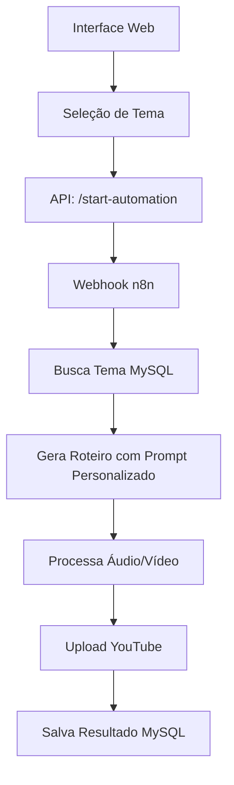

# YouTube Automation - Interface de Seleção de Temas

Sistema completo de automação para criação de vídeos YouTube com interface web para seleção de temas personalizados.

## 🚀 Funcionalidades

- **Interface Web Responsiva** para seleção de temas
- **Banco MySQL** com temas e prompts personalizados
- **API RESTful** para integração com n8n
- **Workflow n8n Otimizado** sem armazenamento local
- **Sistema de Monitoramento** com estatísticas em tempo real

## 📁 Estrutura do Projeto

```
📦 YouTube Automation
├── 📄 interface_selecao_temas.html    # Interface web principal
├── 📄 api_server.js                   # Servidor API Node.js
├── 📄 package.json                    # Dependências Node.js
├── 📄 .env.example                    # Exemplo de configuração
├── 📄 setup_mysql.sql                 # Script de setup do banco
├── 📄 youtube_otimizado_mysql.json    # Workflow n8n otimizado
├── 📄 queries_uteis_mysql.md          # Queries úteis para monitoramento
└── 📄 README_INTERFACE.md             # Este arquivo
```

## 🛠️ Instalação e Configuração

### 1. **Configurar o Banco MySQL**

```bash
# 1. Acesse o MySQL
mysql -u root -p

# 2. Execute o script de setup
source setup_mysql.sql

# 3. Verifique se as tabelas foram criadas
USE youtube_automation;
SHOW TABLES;
```

### 2. **Configurar o Servidor API**

```bash
# 1. Instalar dependências Node.js
npm install

# 2. Copiar arquivo de configuração
cp .env.example .env

# 3. Editar configurações no arquivo .env
nano .env
```

**Configurar o arquivo `.env`:**
```env
DB_HOST=localhost
DB_USER=root
DB_PASSWORD=sua_senha_mysql
DB_NAME=youtube_automation
PORT=3000
N8N_WEBHOOK_URL=http://localhost:5678/webhook/start-youtube-automation
```

### 3. **Configurar o n8n**

```bash
# 1. Importe o workflow
# Arquivo: youtube_otimizado_mysql.json

# 2. Configure as credenciais:
# - MySQL Database
# - ElevenLabs API
# - GROQ API
# - Google APIs (Drive, Sheets)
# - YouTube API

# 3. Ative o workflow
```

### 4. **Iniciar o Sistema**

```bash
# Terminal 1: Iniciar API
npm start

# Terminal 2: Iniciar n8n (se não estiver rodando)
npx n8n start

# Acessar: http://localhost:3000
```

## 🎨 Interface Web

### **Página Principal**
- **Seleção de Temas**: Cards visuais com temas predefinidos
- **Informações do Tema**: Descrição, tags sugeridas, cores personalizadas
- **Botão de Início**: Inicia a automação com um clique

### **Temas Disponíveis**

O sistema vem com os seguintes temas pré-configurados:

#### 🎬 **Entretenimento & Terror**
- **Horror Extraterrestre** - Histórias de terror com alienígenas
- **Assombração Alienígena** - Terror cósmico com encontros brasileiros
- **Contos de Terror Urbano** - Lendas urbanas e mistérios da cidade
- **Fenômenos Paranormais** - Investigação de eventos inexplicados

#### 📚 **Educação & Ciência**
- **Mistérios Históricos** - Enigmas não resolvidos da história
- **Ciência e Tecnologia** - Descobertas e avanços científicos
- **Experimentos Científicos** - Ciência de forma divertida
- **Tecnologia do Futuro** - Inovações que vão mudar o mundo
- **Mistérios do Espaço** - Fenômenos cósmicos e descobertas
- **Neurociência Aplicada** - Como o cérebro funciona
- **Civilizações Perdidas** - Culturas antigas e seus mistérios

#### 🌟 **Desenvolvimento & Lifestyle**
- **Biografias Inspiradoras** - Histórias de pessoas extraordinárias
- **Desenvolvimento Pessoal** - Estratégias para crescimento pessoal
- **Psicologia do Sucesso** - Mentalidade de pessoas bem-sucedidas
- **Longevidade e Saúde** - Segredos para uma vida saudável

#### 🌍 **Curiosidades & Natureza**
- **Curiosidades do Mundo** - Fatos interessantes sobre nosso planeta
- **Vida Selvagem Extrema** - Animais perigosos e fenômenos da natureza

> **💡 Dica**: Você pode adicionar mais temas editando diretamente no banco de dados ou executando o arquivo `temas_adicionais.sql`

### **Temas Disponíveis**
1. **Horror Extraterrestre** 👽 - Histórias de terror alien
2. **Mistérios Históricos** 📜 - Enigmas não resolvidos
3. **Ciência e Tecnologia** ⚛️ - Descobertas científicas
4. **Biografias Inspiradoras** 👤 - Histórias de sucesso
5. **Curiosidades do Mundo** 🌍 - Fatos interessantes
6. **Desenvolvimento Pessoal** 📈 - Dicas de crescimento

## 🔌 API Endpoints

### **Buscar Temas**
```http
GET /api/themes
```
```json
{
  "success": true,
  "data": [
    {
      "id": 1,
      "nome": "Horror Extraterrestre",
      "descricao": "Histórias de terror envolvendo alienígenas",
      "prompt_roteiro": "Crie um roteiro de horror...",
      "tags_sugeridas": ["horror", "alien", "ufo"],
      "cor_hex": "#8B0000",
      "icone": "alien"
    }
  ]
}
```

### **Iniciar Automação**
```http
POST /api/start-automation
Content-Type: application/json

{
  "tema_id": 1
}
```

### **Buscar Projetos**
```http
GET /api/projects?status=concluido&limit=10
```

### **Estatísticas**
```http
GET /api/stats
```

## 🗄️ Estrutura do Banco

### **Tabela: youtube_temas**
```sql
id, nome, descricao, prompt_roteiro, prompt_imagens, 
tags_sugeridas, categoria_youtube, cor_hex, icone, 
ordem_exibicao, ativo, created_at, updated_at
```

### **Tabela: youtube_projects**
```sql
id, project_id, tema_id, title, description, tags, 
status, youtube_video_id, error_message, processing_time,
created_at, updated_at
```

### **Tabela: youtube_files**
```sql
id, project_id, file_type, file_name, file_data, 
mime_type, file_size, created_at, updated_at
```

## 🔄 Fluxo de Automação



## 📊 Monitoramento

### **Queries Úteis**
```sql
-- Projetos em andamento
SELECT * FROM youtube_projects WHERE status IN ('iniciado', 'processando');

-- Estatísticas por tema
SELECT t.nome, COUNT(p.id) as total_videos 
FROM youtube_temas t 
LEFT JOIN youtube_projects p ON t.id = p.tema_id 
GROUP BY t.id;

-- Uso de armazenamento
SELECT file_type, COUNT(*) as arquivos, 
       SUM(LENGTH(file_data) * 3/4) / 1024 / 1024 as tamanho_mb
FROM youtube_files GROUP BY file_type;
```

### **Limpeza Automática**
```sql
-- Execute diariamente para limpar arquivos antigos
CALL CleanOldFiles(7); -- Remove arquivos com mais de 7 dias
```

## 🔧 Personalização

### **Adicionar Novo Tema**
```sql
INSERT INTO youtube_temas (
    nome, descricao, prompt_roteiro, prompt_imagens,
    tags_sugeridas, categoria_youtube, cor_hex, icone, ordem_exibicao
) VALUES (
    'Seu Tema',
    'Descrição do tema',
    'Prompt personalizado para o roteiro...',
    'prompt, para, imagens',
    '["tag1", "tag2", "tag3"]',
    '22',
    '#FF5733',
    'icon-name',
    10
);
```

### **Modificar Interface**
- Edite `interface_selecao_temas.html`
- Adicione novos ícones em `THEME_ICONS`
- Personalize CSS para cores e layout

### **Estender API**
- Adicione novos endpoints em `api_server.js`
- Implemente validações personalizadas
- Adicione middleware de autenticação

## 🚨 Solução de Problemas

### **Erro de Conexão MySQL**
```bash
# Verificar se o MySQL está rodando
sudo systemctl status mysql

# Testar conexão
mysql -u root -p -e "SELECT 1"
```

### **Erro no n8n Webhook**
```bash
# Verificar URL do webhook
curl -X POST http://localhost:5678/webhook/start-youtube-automation \
  -H "Content-Type: application/json" \
  -d '{"tema_id": 1}'
```

### **Interface não carrega temas**
```bash
# Verificar API
curl http://localhost:3000/api/themes

# Verificar logs do servidor
npm start
```

## 🔐 Segurança

- **Validação de entrada** em todos os endpoints
- **Escape de SQL** usando prepared statements
- **CORS configurado** para domínios permitidos
- **Rate limiting** para prevenir abuso
- **Logs de auditoria** para monitoramento

## 📈 Performance

- **Pool de conexões MySQL** para melhor performance
- **Índices otimizados** nas tabelas
- **Cache de resultados** para consultas frequentes
- **Compressão de resposta** HTTP
- **Limpeza automática** de dados antigos

## 🔄 Backup e Recuperação

```bash
# Backup do banco
mysqldump -u root -p youtube_automation > backup_$(date +%Y%m%d).sql

# Restaurar backup
mysql -u root -p youtube_automation < backup_20250820.sql
```

## 📞 Suporte

Para problemas ou dúvidas:
1. Verifique os logs do servidor e n8n
2. Consulte as queries úteis para diagnóstico
3. Execute os scripts de verificação de integridade

---

**Sistema desenvolvido para automação completa de criação de vídeos YouTube com interface amigável e backend robusto!** 🎬✨
